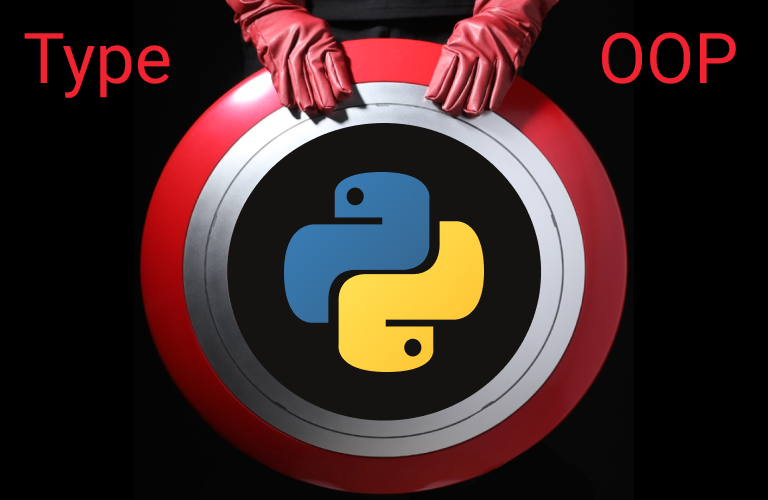

# [타입 파이썬!](https://www.inflearn.com/course/%ED%83%80%EC%9E%85-%ED%8C%8C%EC%9D%B4%EC%8D%AC/)

 

---

# 🛡 견고한 Python(파이썬) 🛡

## class에 대한 올바른 사용법과 객체지향 프로그래밍 OOP & typing 방법
---

# Contents

## 객체지향 프로그래밍 이해

## 파이썬에서 객체지향 프로그래밍하기

## 파이썬에서 타이핑하기

## 배운 것을 응용하기

---

# amamov@kakao.com
